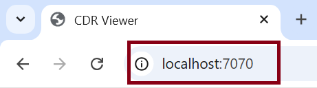
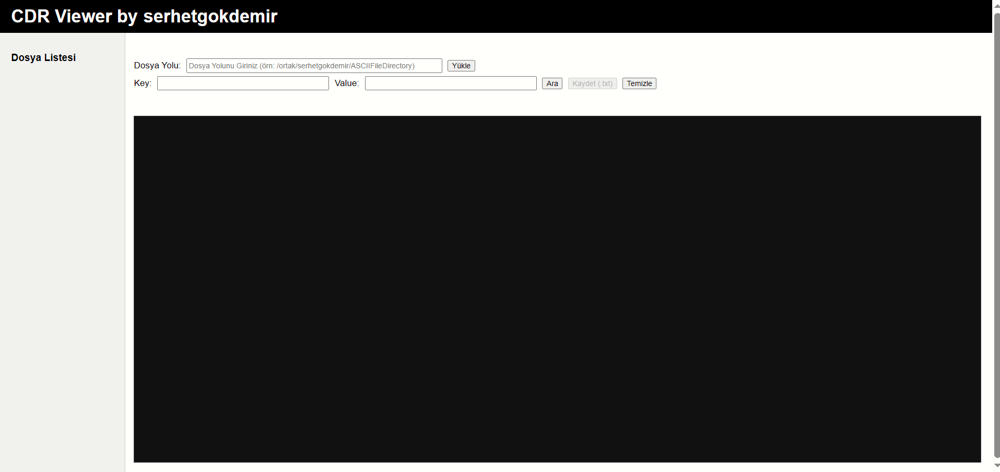
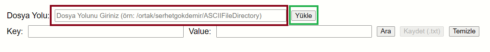
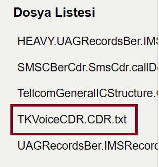
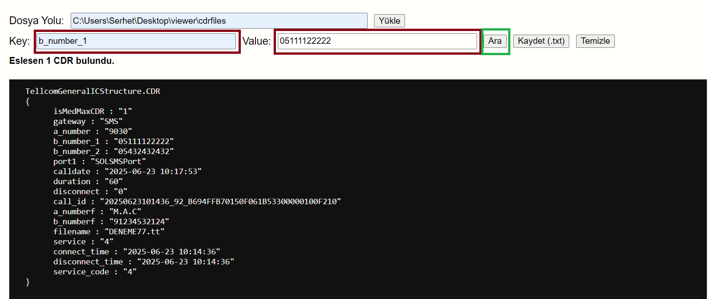
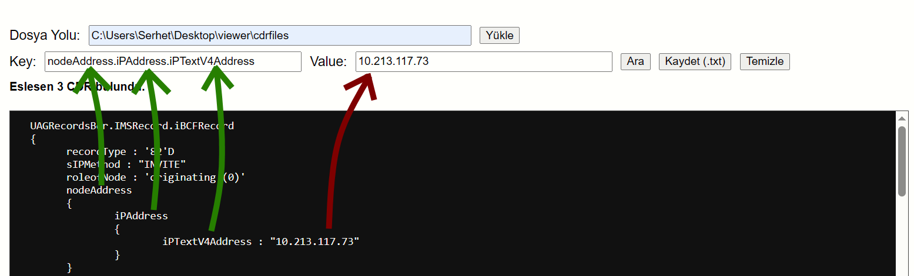
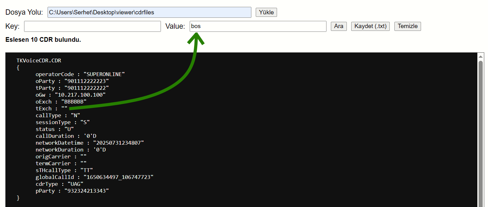
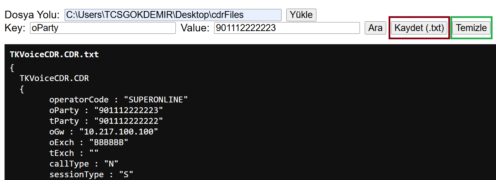

# CDR Viewer

## Dokümantasyon Özeti
Alt başlıklarda sırasıyla Uygulamanın Amacı, Hedef Kitlesi, Özellikler, Kurulum, Kullanım ve Yapılabilecek İyileştirmeler konularına yer verilmiştir

## Uygulamanın Amacı
Uygulama, 
- CDR dosya yapılarını görüntülemeyi ve incelemeyi,
- Arama ve eşleştirme yöntemlerini kullanarak CDR dosyalarındaki tutarsızlıkları hızlı bir şekilde tespit etmeyi

amaçlar.

## Hedef Kitlesi
ASCII formatında olan CDR dosyaları ile okuma, arama ve kaydetme işlemleri yapmak isteyen kullanıcılar.

## Özellikler
- Key-value çiftinden en az birini girerek CDR dosyasında birebir arama yapma.
- "bos" value değerini girerek seçili dosyada boş değer araması yapma.
- Dosya üzerinde yapılan eşleştirmeyi sıfırlama.
- Yapılan arama sonucunu metin dosyası (.txt) olarak kaydetme.
- Lazy loading (asenkron yükleme) ile performans artışı.

## Kurulum
1. Repoyu kopyalayın:
```bash
git clone https://github.com/serhetgokdemir/cdr-viewer
```
2. Bulunduğu dosyaya gidin:
```bash
cd cdr-viewer
```
3. Uygulamayı çalıştırın:
```bash
mvn spring-boot:run
```
4. Tarayıcıdan uygulamaya erişin:
```arduino
http://localhost:7070
```


## Kullanım
1. localhost:7070 ile uygulamaya giriş yapın<br>
<br><br>
2. Uygulamanın giriş sayfası aşağıdaki gibi olmalıdır.<br>
<br><br>
3. Dosya yolunu girin ve `Yükle` butonuna tıklayın.<br>
<br><br>
4. Soldaki `Dosya Listesi` menüsünden çalışacağınız dosyayı seçin.<br>
<br><br>
5. Eşleştirme yapmak istediğiniz `key` veya `value` değerinden en az birini girip `Ara` butonuna tıklayın.<br>
<br><br>
6. Nested CDR durumunda ulaşmak istediğiniz `key`'i kullanmak için keyler arasına nokta koyarak ulaşın.<br>
<br><br>
7. Boş değerleri bulmak isterseniz `value` girişine `bos` yazın.<br>
<br><br>
8. `Kaydet` butonuna tıklayarak sonucu (.txt) olarak kaydedin veya `Temizle` butonuna tıklayarak yaptığınız aramayı sıfırlayın.<br>
<br><br>

## Yapılabilecek İyileştirmeler
1. Uygulamanın büyük dosyalarda daha iyi performans gösterebilmesi için farklı arama algoritmaları kullanılabilir.
2. Farklı exception handling case'leri yazılabilir.
3. Arayüz iyileştirmeleri yapılabilir
4. Sekme özelliği eklenebilir.
5. Yapılan eşleşmeler ekranda highlighted yazıyla gösterilebilir (örn. sarı renk ile).
6. Yeni unit testler eklenebilir.
7. Proje dockerize edilebilir.
8. Çoklu aramalar eklenebilir.
9. "X kriterini içersin Y kriterini içermesin" tarzı mantık işlemlerinin olduğu çoklu aramalar eklenebilir.

## Görüş ve Önerileriniz İçin
`serhetgokdemir@gmail.com` adresinden iletişime geçebilirsiniz.